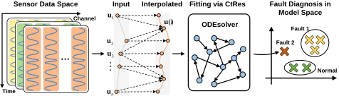
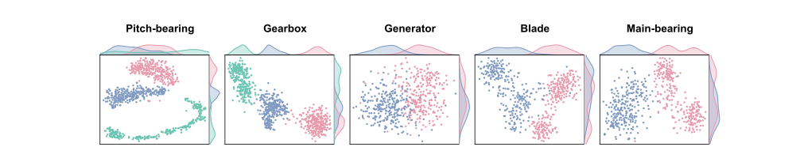
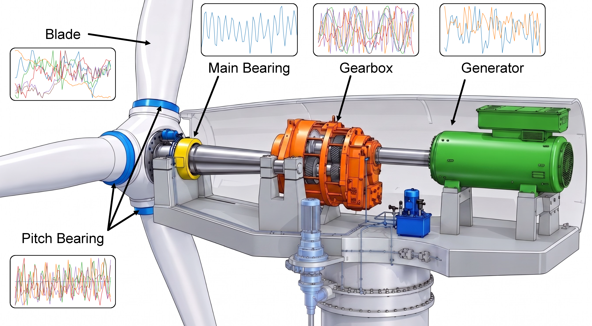

# LeMo (CtRes)




## Framework Overview

This project applies the **Learning in the Model Space (LeMo)** framework to **wind turbine fault diagnosis from irregular sensor time series**. Rather than performing diagnosis directly in the raw data space, the project represents each sensor sequence in an induced **model space**, where the temporal dynamics of the sequence can be captured in a more compact and stable form.

To make LeMo suitable for irregularly sampled wind turbine sensor data, we incorporate **CtRes**, a Continuous-time Reservoir Network, as the sequence fitting model. For each sensor sequence, CtRes models its temporal evolution through continuous-time reservoir dynamics and produces a corresponding readout model, which is used as the sequence representation in the model space.

Based on these representations, the project compares sensor sequences according to their underlying temporal dynamics instead of only their raw observations. This makes the approach effective for separating normal operating behavior from fault-related patterns under irregular sampling conditions.

The clustering behaviour of the learned representations is illustrated below.



The resulting framework supports two diagnosis settings:

* **Offline diagnosis**, where collected samples are used for fault classification
* **Online monitoring**, where new observations are compared with a reference model space to detect abnormal behavior


## Method

LeMo consists of three key stages for fault diagnosis in irregular sensor time series:

1. **Sequence fitting in the model space**

   Each sensor sequence is fitted by CtRes, which captures its temporal dynamics through continuous-time reservoir state evolution. The resulting readout model is then used as the representation of that sequence in the model space.

2. **Distance modeling between sequence representations**

   A distance metric is defined between readout model representations so that distances in the model space reflect differences in the intrinsic temporal dynamics of the original sensor sequences.

3. **Fault diagnosis in the model space**

   Fault diagnosis is performed directly on the learned representations, supporting both offline fault classification and online streaming fault detection.

## Dataset

To comprehensively characterise the operating condition of the wind turbine, vibration acceleration data were collected from its major components using accelerometers, as shown below.



The dataset covers the key components of the wind turbine and provides a comprehensive description of its operating state:

- **Pitch-bearing**

  Vibration acceleration signals were collected from the three pitch bearings in both radial and axial directions. Each pitch bearing was monitored by two channels, resulting in six synchronized observation channels sampled at `1280 Hz`. This dataset contains three condition labels: normal operation, damage in one pitch bearing, and damage in all three pitch bearings.

- **Gearbox**

  Vibration acceleration signals were collected from six gearbox measurement positions, including the radial direction of the low-speed shaft, the radial direction of the first-stage planetary stage, the radial direction of the high-speed shaft, the axial direction of the high-speed shaft, the radial direction of the input shaft, and the radial direction of the intermediate shaft. All channels were sampled at `2560 Hz`. This dataset contains three condition labels: normal operation, fault in the high-speed-end gear, and combined faults in the low-speed shaft and high-speed-end gear.


- **Generator**

  Vibration acceleration signals were collected from the radial directions of the non-drive end and drive end of the generator, forming two synchronized observation channels sampled at `25,600 Hz`. This dataset contains two condition labels: normal operation and generator-bearing damage.

- **Blade**

  Vibration acceleration signals were collected from the three blades in both flapwise and edgewise directions. Each blade was monitored by two channels, resulting in six synchronized observation channels sampled at `1280 Hz`. This dataset contains two condition labels: normal operation and single-blade abnormality.

- **Main-bearing**

  Vibration acceleration signals were collected from the main bearing in the horizontal direction, forming a single observation channel sampled at `2560 Hz`. This dataset contains two condition labels: normal operation and main-bearing damage.

## Usage

Environment setup:

1. Create a virtual environment (Python 3.11):

```bash
conda create --prefix="./pure_py311" python=3.11
```

2. Activate the virtual environment:

```bash
conda activate ./pure_py311/
```

3. Install dependencies:

```bash
python -m pip install -r requirements.txt
```

Run options:

- `python run.py`

  By default, the script loads the five wind turbine component datasets in `WindTurbineDataset` and runs the full offline diagnosis pipeline for:

  - Pitch-bearing
  - Gearbox
  - Generator
  - Blade
  - Main-bearing

  For each dataset, the script:

  1. loads the pre-split train/test `.npz`
  2. extracts CtEcho features
  3. trains an RBF SVM
  4. reports training accuracy, test accuracy, classification report, and confusion matrix
  5. generates a final t-SNE visualization

- `python run.py path/to/split_data.npz`

  Run the pipeline on a user-prepared split dataset.

Supported arguments:

- `npz_path`: optional path to a split `.npz` dataset
- `--dataset-dir`: override the `WindTurbineDataset` directory
- `--batch-size`: override `CtEchoConfig.batch_size`
- `--num-workers`: override `CtEchoConfig.num_workers`
- `--device`: choose compute device such as `cpu` or `cuda`
- `--plot-tsne`: display t-SNE for a single-task run or a custom split `.npz`

Custom dataset format:

If you want to load your own split dataset, the `.npz` file only needs to contain one valid name from each of the following groups:

- Train data: `x_train_irregular` or `X_train_irregular` or `x_train` or `X_train`
- Test data: `x_test_irregular` or `X_test_irregular` or `x_test` or `X_test`
- Train timestamps: `timestamps_train` or `t_train` or `timestep_train` or `timesteps_train`
- Test timestamps: `timestamps_test` or `t_test` or `timestep_test` or `timesteps_test`
- Train labels: `y_train` or `labels_train` or `train_labels`
- Test labels: `y_test` or `labels_test` or `test_labels` or `true_labels`

Expected shapes:

- train/test data: `[batch, length, channels]`
- train/test timestamps: `[batch, observed_length]`
- train/test labels: `[batch]`


Main dependencies:

- python == 3.11
- numpy == 2.1.2
- torch == 2.6.0
- torchcde == 0.2.5
- torchdiffeq == 0.2.5
- scikit-learn == 1.6.1
- scipy == 1.17.1
- h5py == 3.16.0
- matplotlib == 3.10.8
- pandas == 3.0.2
- tqdm == 4.67.3
